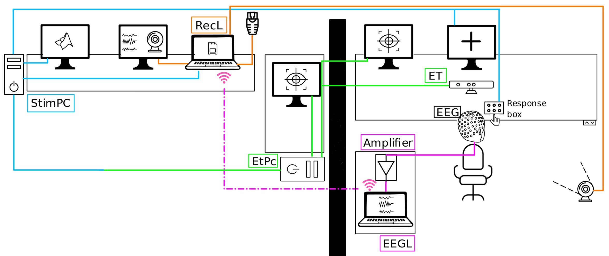

### Hardware & software

#### EEGL (=EEG Laptop)
*OS (Dualboot)*: Windows 10 Pro (64 bit), Ubuntu 20.04.4 LTS

*Software Win*: LSL, eego LSL App, Brainvision LSL Viewer, ANT SDK (Amplifier), VSCode

*Software Linux*: LSL, eego LSL App, ANT SDK, Miniconda

*Main purposes*: 
- Check impedances
- Send EEG data + triggers from amplifier to RecL

*Network*
- Wifi (RecL) or Ethernet

#### RecL (=Recording Laptop)
*OS*: Ubuntu 20.04.3 LTS

*Software*: LSL, LSL Viewer, LSL Recorder, VSCode, Miniconda, nomachine, gucview, wifihotspot

*Main purposes*:
- Receive EEG data via LSL, combine, and save data and triggers into one .xdf file
- Network base: connected to eduroam, provides wifi for EEGL and ethernet for StimPC
- Automatically upload data to DaRUS (data repository)
- Keep an eye on the experiment during measurements via webcam (gucview)

*Network*
- USB ethernet (Docking station) to eduroam
- PCI ethernet to StimPC
- Wifi to EEGL via wifi hotspot

#### StimPC (=Stimulus PC)
*OS*: Ubuntu 20.04.3 LTS

*Software*: LSL, PsychoPy, Miniconda, Spyder, Matlab, EyeLink SDK

*Main purposes*:
- Present stimuli (Psychtoolbox, PsychoPy)
- Receive triggers (button box + ET)
- Send triggers (stimuli + button box + ET) to RecL

*Network*
- Ethernet to RecL
- Ethernet to ETPC
- (LPT (=parallel port) to amplifier)

#### ETPC (=Eye Tracking PC)
*OS*: ET OS, Windows

*Main purposes*: 
- Send triggers and eye movement data to StimPC

*Network*
-Ethernet to StimPC
-Ethernet to ET (=eye tracker)

#### Further hardware
**Amplifier**: amplification and AD conversion of EEG signal, EEG sample triggers

**Button box (or keyboard)**: manual response by participant during experiment - triggers are sent to StimPC

**Bipolar electrodes**: record from additional sensors like EMG, photoresistor, etc.

**Interphone system**: communication with participant during experiment