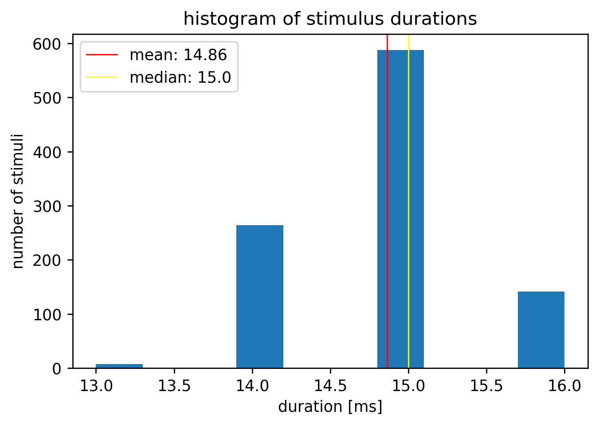
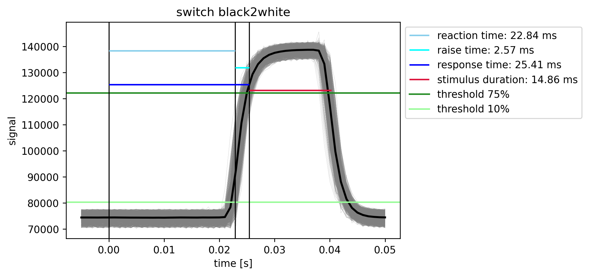

# **Timing test: EEGManyLabs**
The goal of this project was to test the timing of stimulus presentations. Specifically, we needed to ensure that images were presented for exactly one frame, not more. On a 60 Hz monitor that is 16.67 ms. For stimulus presentation, the script '1_timingTest_stimulusPresentation.py' was used. Here, a white rectangle is presented at a corner of the stimulus monitor for 1 frame at a time via PsychoPy. On the same corner of the monitor a photoresistor was placed. The switch from black to white and back to black was then used in the '2_timingTest_evaluation.py' script to evaluate for how long the image was presented. High values indicate that the screen is white at the position of the photoresistor, while low values indicate that the screen is black and therefore no stimulus is presented at that time/data point. The data is first restricted to 5-95 % of the range between min and max values for robustness against outliers. The stimulus was then considered as 'ON' from the first data point exceeding a 10% threshold to the last data point before then falling below a 75% threshold.
This histogram of stimulus durations confirms that all of the 1000 stimuli were presented for only one frame - as intended:

Here we can see the black2white switch, as recorded by the photoresistor:

Each grey line represents one image/trial, the black line is the mean over 1000 trials. Explanations on the difference between reaction time, raise time, and response time can be found in this beautiful [blog post](https://benediktehinger.de/blog/science/latency-measurements-in-a-vision-lab/).

### Usage

Run '2_timingTest_evaluation.py' in the 'mne.yml' conda environment to evaluate stimulus timings. The data example 'sub-005_ses-001_task-Default_run-003_eeg.xdf' can be used to recreate the figures above.
